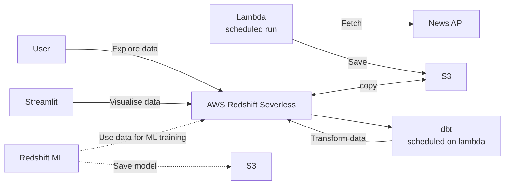

# News of the Day

Suggest only limited amount of news carefully selected for you so that you
won't waste your time keep checking news across multiple news sources and
read many similar articles.

This is a toy project to learn new skills / technologies or system designs.

